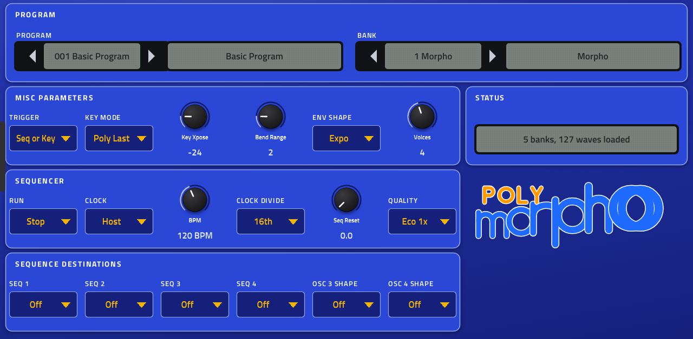

# Morpho-PE

A four-voice synthesizer for Akai MPC OS 3.x standalone devices (Force, MPC Live / One / X / Key; not MPC OS 2.x, whose skin format
it does not use), built as a native VST2 instrument with
its own screen skin and Q-Link pages. It plays the way the DSI Poly Evolver's voice does: two analog-style oscillators and two
digital waveshape oscillators per voice, a stereo 2/4-pole lowpass and VCA, the DSP side's highpass, tuned feedback, distortion,
three-tap delay and output hack, three envelopes, four LFOs, the modulation slots and fixed controller routes, and the 4 x 16 step
sequencer with its trigger modes. Its program is the instrument's own 128 parameters and 64 sequencer steps, so Poly Evolver and
Evolver program dumps load as they are.



*The name: the Blue Morpho is an iridescent blue butterfly, and to morph is to change form, as the instrument's sounds do.
Morpho-PE is an independent project, not affiliated with or endorsed by Dave Smith Instruments or Sequential. The PE in the
name is a nod to the instrument it is modelled on.*

**Status: version 1.0.** It builds, passes the offline host test and its own engine tests, and has been installed, played and
CPU-benched on a Force. The analog section is a model, not a measurement of the instrument (see "What is missing"), and the CPU bench
reports FAIL by its stress thresholds: normal playing uses 13-17 % of a block on a Force at the default Eco quality (4 voices), the
Q-Link-sweep stress test peaks at about 56 % at p99. See [docs/STATUS.md](docs/STATUS.md) for the current state, the bench numbers
and the open items.

## Features

- **Voices:** 1-8 selectable (default 4), each with the instrument's two analog-style oscillators (saw, triangle, saw-triangle,
  pulse width 0-99 that switches off at the extremes) and two digital waveshape oscillators, with hard sync, FM and ring
  modulation both ways between the digital pair, per-oscillator shape sequencing, noise and slop.
- **Filter and amplifier:** stereo (left/right) 2- or 4-pole resonant lowpass with envelope, velocity, key tracking, audio
  modulation and split; VCA with envelope and velocity; the seven output pan modes.
- **FX section:** tuned feedback with grunge, 4-pole highpass (pre/post is not modelled, see below), distortion with noise gate,
  three-tap delay with both feedback paths and tempo-synced times, output hack.
- **Modulation:** three envelopes (env 3 with delay; exponential or linear), four LFOs (synced rates, key sync), four modulation
  slots, the seven fixed controller routes, all 68 destinations.
- **Sequencer:** the 4 x 16 step sequencer with rests, resets, swing, clock modulation and every trigger mode.
- **Keyboard:** poly, mono and unison 1/2 with the six key priorities and per-oscillator glide (normal, fingered, keyboard off).
- **Program format:** the instrument's own 128 parameters and 64 sequencer steps, so its program, bank, edit-buffer and waveshape
  dumps load unchanged; banks of programs from `.syx` files; Prophet VS wave dumps and single-cycle WAV banks as wave sources.
- **Plugin:** 278 parameters, a nine-tab skin and Q-Link pages, MIDI CCs, project state, a **Quality** control (analog section at
  1x, 2x or 4x oversampling; Ultra 4x runs at 2x above 4 voices, to stay inside the Force's CPU budget).

## Technology

- **Engine:** portable C (`src/engine.c`, about 1 300 lines, plus `curves.c`, `waves.c`, `syx.c`, `presets.c`), 44.1 kHz,
  control rate every 8 samples, audio at the host block size. No dynamic allocation on the audio thread; flush-to-zero set on
  ARM and x86.
- **Analog section** (oscillators 1/2, mixer, lowpass, VCA), run oversampled with Kaiser half-band decimators:
  - **Oscillator:** a ramp-core VCO in the manner of a CEM3340: band-limited saw and pulse (polyBLEP), triangle with polyBLAMP
    corners, a slight ramp bend, slow thermal drift, band-limited hard sync.
  - **Lowpass:** four OTA integrators in cascade in the manner of a CEM3320, each limiting its own input, zero-delay-feedback
    trapezoid stages with the tanh gain taken from the previous sample, resonance from stage 4 (4-pole) or stage 2 (2-pole), so
    only the 4-pole mode self-oscillates, as on the instrument.
  - **VCA:** an OTA that saturates softly. Written from the literature (Valimaki and Huovilainen; Zavalishin, *The Art of VA
    Filter Design*; mystran's nonlinear zero-delay notes); no GPL code. Compared offline with the OB-Xd 4-pole algorithm.
- **Digital section** (oscillators 3/4, highpass, feedback, distortion, delay, hack) at the base rate, as the instrument's DSP runs
  it, including the DSP's own behaviour where the firmware shows it: hard-clipping distortion, the noise gate, grunge as integer
  wrap-around, bit-mask output hack.
- **Skin:** a layout file (`tools/gen_layout.py`) rendered by a headless browser (`"art": "html"`), signal-flow drawings written by
  the generator, nine tabs, Q-Link pages per section.

## How it was derived, and how close it is

The instrument's three update files (main CPU, voice CPU, DSP) are public. They were decoded offline with tools in `tools/fw/`
(an update-format decoder, an ADSP-219x disassembler and interpreter, PIC18 and dsPIC disassemblers) and read against the manual.
**Nothing from them is stored here**: the engine holds formulas and short breakpoint lists fitted to what they contain, each
documented with its numbers in [docs/FIRMWARE.md](docs/FIRMWARE.md); the tools re-derive everything from your own files.

| Part | Source | Closeness |
|---|---|---|
| Program format, parameter ranges | Manual + the DSP's range table (all 128 agree) | Exact |
| Oscillator tuning, delay taps, LFO rates, highpass cutoffs | DSP tables | Exact (fitted formulas) |
| Envelopes: tick rate (12 kHz), linear attack, exponential decay/release, attack curve, linear shape | DSP code, run in an ADSP-219x interpreter | Exact to the tables' precision |
| Modulation: amount curves and depth of pitch, levels, FM/RM, pulse width, LFO, envelope rates, highpass, delay, pan, VCA, feedback | DSP code | Exact; filter-frequency depth is an estimate (56 semitones) |
| Distortion gain and hard clip, noise gate, grunge, output hack | DSP code, interpreter | Exact |
| Glide, Env 3 delay | Voice-CPU tables and timer | Exact in shape; times assume a 40 MHz clock (not in the file) |
| Unison detune (-1/+1/-3/+3 and -3/+3/-8/+8 cents) | Main-CPU table | Exact |
| Oscillator 1/2, lowpass and VCA sound | Circuit-style models from the literature | **Modelled, not measured** |
| Digital waves | Your own Prophet VS program ROM images (or a single-cycle recording) | **Exact** from the ROM chips (95 waves, 12-bit, decoded); a recording is matched by correlation (88 slots) |

## What is missing

- **The analog character is a model.** The real oscillators, filter and VCA are calibrated analog circuits; their exact
  cutoff-to-Hz curve, resonance and self-oscillation level, drive, drift, left/right differences and VCA response need
  recordings of a real instrument. The OTA limiting levels were set so the filter is clean at normal levels and self-oscillates near 0.5 (compared with OB-Xd), not measured on the instrument.
- **The original's waves are not included.** Supply your own Prophet VS program ROM images (the two 27256 chips, any VS version) and
  the plugin reads the 95 ROM waves from them exactly; Evolver wave 96 (not a VS wave) keeps a stand-in. Without the chips, a
  single-cycle recording (the Morphagene collection) fills 88 slots by correlation (docs/FIRMWARE.md sections 13-14).
- **Removed:** the external audio input. Its parameters stay in the program (so dumps load and re-save intact, marked "unused") but
  it has no controls, no sound and no peak / envelope-follower sources; the Ext In trigger modes act like their keyboard counterparts.
- **Not modelled:** distortion and highpass
  placed before the filter (settings 100-199), the sequencer's MIDI-out destinations (MPC takes no MIDI from a VST), and the
  oscillators' per-unit calibration.
- **Estimated or assumed:** filter-frequency modulation depth, the 40 MHz voice-CPU clock, the audio-mod, split and key-tracking
  scales (read by the voice CPU or DSP, not yet traced).
- **Device status:** installed and CPU-benched on a Force (about 17 % of a block for four voices at 1x oversampling, about 31 % at
  2x); a Q-Link sweep still shows rare spikes, and the on-device listening tests (all tabs, Q-Links, project save/reload, the
  SYSEX folder) are not done. Gen 2 hardware and MPC OS 2.x are untested.

## Your own sounds and waves

Nothing from the instrument is shipped: no programs, no waves, no firmware. Without any files, eight built-in programs of this project's
own play on an open set of waves. Everything below is optional and comes from files you already have; you copy them into the plugin's
`SYSEX` folder (`/sdcard/Synths/sd88me - VST - Morpho-PE/SYSEX`, made on first load; files next to the plugin work too) and restart
MPC, because the folder is read at start-up. Files load in name order and a later file overwrites the same slots.

| You want | Put in `SYSEX` | What it is | Where you get it |
|---|---|---|---|
| The factory (or your own) **programs** | `.syx` program or bank dumps | One program, one bank, or an "all banks" dump of a Poly Evolver / Evolver. Each bank in a file becomes a bank on the BANKS tab, named after the file (a file of four banks, such as the PolyKey "Programs and Combos" release, shows as four) | the instrument's SysEx dump, or the manufacturer's download page |
| The factory **waves** (1-95), exact | two `.bin` or `.rom` files: the Prophet VS's high-byte and low-byte program ROM chips | 27256 EPROM images, 32 KB each (or their upper 16 KB, or one 64 KB interleaved image); the order of the two files does not matter | your own dump of a Prophet VS's ROM chips (any version) |
| The same waves, **approximately** | one single-cycle `.wav` of the VS waves | 104 cycles marked by cue points, 16/24/32-bit or float; each cycle goes to the slot it was matched to (cycles 0-86 and 91). It is a recording, so close to the data, not identical; the ROM images win if both are present | a "Prophet VS waves, single cycles" collection |
| Your own **waves** | `.syx` Waveshape Data dumps | each dumped wave replaces its own slot (manual p. 56 and 60) | "Request Waveshape Dump" on a Poly Evolver / Evolver |
| The VS's 32 user waves | `.syx` Prophet VS wave dump (`F0 01 0A 7F`) | they become waves 97-128, the slots the Evolver keeps for user waves | a Prophet VS RAM wave dump |

How to tell it worked: the Program tab's status line reads, for example, "5 banks, 127 waves loaded" (banks found, wave slots filled from
files). The Banks tab lists every bank with its programs. Wave 96 is the Evolver's own wave and keeps a stand-in. The original's
programs and waves are the property of their makers: use files from instruments you own.

## Using it

Nine tabs, grouped like the instrument's panel sections and in its signal order, with amber flow lines showing the path:
**PROGRAM** (program and bank, misc parameters, sequencer clock and run, sequence destinations), **BANKS** (every bank found in the plugin folder in one column, and 42 programs a page in three columns, as tiles: tap a bank to browse it, tap a program to load it;
the bank, program and page steppers, the Q-Links (bank, program, page back, page forward) and the data wheel step the same values),
**OSC** (oscillators 1-4 and noise
feeding the filter), **FILTER** (low pass filter into the amplifier), **FX** (high pass, tuned feedback,
distortion, delay, output hack, voice volume), **MOD** (envelope 3 and the four LFOs), **MODS** (the four modulators and the fixed
controller routes; every destination and source is a picker with the choices in groups), **SEQ 1-2** and **SEQ 3-4** (the step
sequencer, one panel of 16 steps per track and one Q-Link page per track).

The look takes its cues from the instrument without copying it: an ultramarine plate, brighter rounded blue sections, black
pointer knobs, red LEDs and a grey LCD. The wordmark and every drawing are this project's own.

**Sequencer.** RUN starts the sequencer on voice 1 (Run, or Transport to follow MPC's play button); CLOCK picks the program's
BPM or MPC's tempo. The gated trigger modes (Key Gates Seq and the others the manual marks AUTO) start a sequence on each key,
on every voice, as on the instrument.

**MIDI.** Notes, pitch bend, mod wheel (CC 1), breath (2), foot (4), volume (7), expression (11), brightness (74), sustain (64),
channel and poly pressure, program change, and the instrument's parameter CCs (manual p. 50-51).

## Building

Needs a checkout of [mpc-vst-plugins](https://github.com/sd88me/mpc-vst-plugins) next to this repo (`../mpc-vst-plugins`),
Python 3, and Docker for the armhf build.

```
tools/make_layout.sh                                            # params.json, src/patch_tab.h, the skin layout and flow drawings
../mpc-vst-plugins/tools/test_port.sh vst/vst.json              # offline host test (ASan)
../mpc-vst-plugins/tools/build_port.sh vst/vst.json             # armhf .so + skin (Docker; the skin uses the browser renderer)
```

Engine tests: see the first lines of `test/test_engine.c`.

## Licence

MIT (see LICENSE), the same as mpc-vst-plugins.
